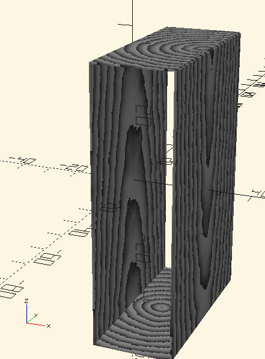
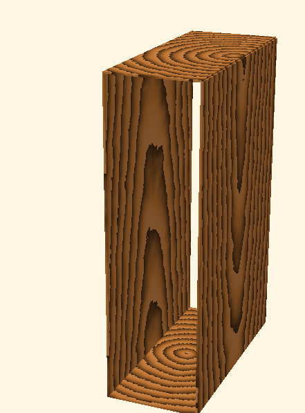
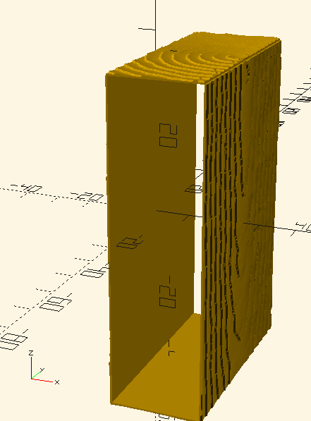
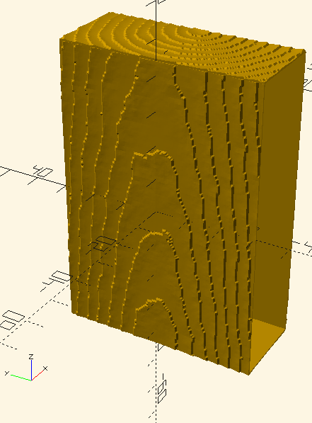

# Sandblasted Wood Grain Procedural Texture in OpenSCAD

3D printed sandblasted wood grain can be generated via a procedural texture model.

We model wood density variation across the season (annual growth ring).

Radial variations make the tree ring not exactly circular.

Variations/offset from the vertical create arch/cathedral patterns when sliced longitudinally.

Given a 3D wood grain texture model, a planar cut/cross section creates a 2D wood density map over the cut surface.  Here a 4-sided box sleeve displays the density in grayscale.

If you can convert the density to a wood tone, this makes a great waxed/stained look.

We can 3D print a wood grain texture by converting the wood density to a height map.  Sandblasting ablates more of the softer earlywood, leaving ridges of high density/slow growth latewood.  Here the outside of the box sleeve is converted to a height map, showing the sandblasted texture.

Here is a view in a different angle.
